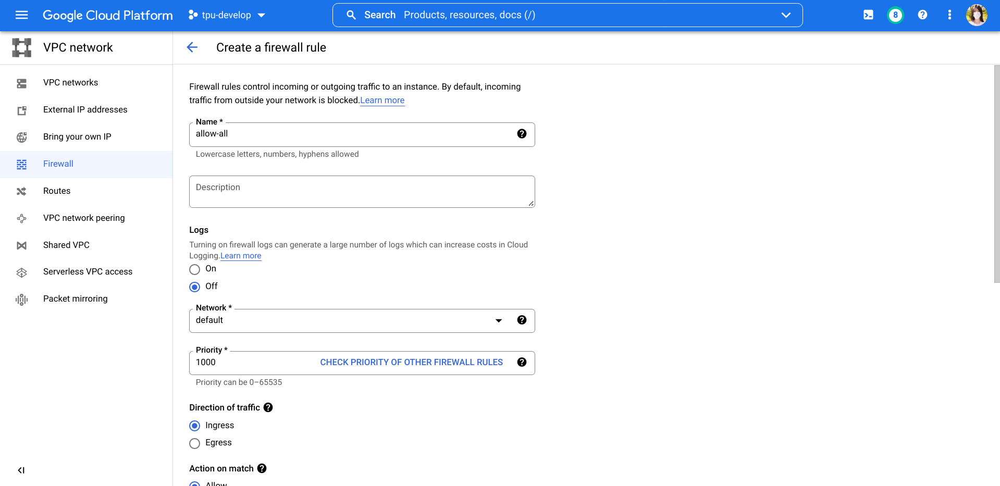

# TPU Starter

<h4 align="center">
    <p>
        <b>English</b> |
        <a href="https://github.com/ayaka14732/tpu-starter/blob/main/README_ko.md">한국어</a>
    <p>
</h4>

Everything you want to know about Google Cloud TPU

* [1. Community](#1-community)
* [2. Introduction to TPU](#2-introduction-to-tpu)
    * [2.1. Why TPU?](#21-why-tpu)
    * [2.2. How can I get free access to TPU?](#22-how-can-i-get-free-access-to-tpu)
    * [2.3. TPU is so good, why haven't I seen many people using it?](#23-tpu-is-so-good-why-havent-i-seen-many-people-using-it)
    * [2.4. I know TPU is good now. Can I touch a real TPU?](#24-i-know-tpu-is-good-now-can-i-touch-a-real-tpu)
    * [2.5. What does it mean to create a TPU instance? What do I actually get?](#25-what-does-it-mean-to-create-a-tpu-instance-what-do-i-actually-get)
* [3. Introduction to the TRC Program](#3-introduction-to-the-trc-program)
    * [3.1. How to apply for the TRC program?](#31-how-to-apply-for-the-trc-program)
    * [3.2. Is it really free?](#32-is-it-really-free)
* [4. Create a TPU VM Instance](#4-create-a-tpu-vm-instance)
    * [4.1. Modify VPC firewall](#41-modify-vpc-firewall)
    * [4.2. Create the instance](#42-create-the-instance)
    * [4.3. SSH to the server](#43-ssh-to-the-server)
* [5. Environment Setup](#5-environment-setup)
* [6. Development Environment Setup](#6-development-environment-setup)
    * [6.1. Set up Mosh and Byobu](#61-set-up-mosh-and-byobu)
    * [6.2. Set up VSCode Remote-SSH](#62-set-up-vscode-remote-ssh)
    * [6.3. How can I verify that the TPU is working?](#63-how-can-i-verify-that-the-tpu-is-working)
* [7. JAX Basics](#7-jax-basics)
    * [7.1. Why JAX?](#71-why-jax)
    * [7.2. Parallelism](#72-parallelism)
        * [7.2.1. Basics of jax.pmap](#721-basics-of-jaxpmap)
        * [7.2.2. What if I want to have randomness in the update function?](#722-what-if-i-want-to-have-randomness-in-the-update-function)
        * [7.2.3. What if I want to use optax optimizers in the update function?](#723-what-if-i-want-to-use-optax-optimizers-in-the-update-function)
    * [7.3. Freeze certain model parameters](#73-freeze-certain-model-parameters)
    * [7.4. Integration with Hugging Face Transformers](#74-integration-with-hugging-face-transformers)
    * [7.5. What is a[:, None]?](#75-what-is-a-none)
* [8. TPU Best Practices](#8-tpu-best-practices)
    * [8.1. Prefer Google Cloud Platform to Google Colab](#81-prefer-google-cloud-platform-to-google-colab)
    * [8.2. Prefer TPU VM to TPU node](#82-prefer-tpu-vm-to-tpu-node)
* [9. JAX Best Practices](#9-jax-best-practices)
    * [9.1. Import convention](#91-import-convention)
    * [9.2. Manage random keys in JAX](#92-manage-random-keys-in-jax)
    * [9.3. Serialize model parameters](#93-serialize-model-parameters)
    * [9.4. Conversion between NumPy arrays and JAX arrays](#94-conversion-between-numpy-arrays-and-jax-arrays)
    * [9.5. Conversion between PyTorch tensors and JAX arrays](#95-conversion-between-pytorch-tensors-and-jax-arrays)
    * [9.6. Type annotation](#96-type-annotation)
    * [9.7. Check if an array is either a NumPy array or a JAX array](#97-check-if-an-array-is-either-a-numpy-array-or-a-jax-array)
    * [9.8. Get the shapes of all parameters in a nested dictionary](#98-get-the-shapes-of-all-parameters-in-a-nested-dictionary)
    * [9.9. The correct way to generate random numbers on CPU](#99-the-correct-way-to-generate-random-numbers-on-cpu)
    * [9.10. Use optimizers from Optax](#910-use-optimizers-from-optax)
    * [9.11. Use the cross-entropy loss implementation from Optax](#911-use-the-cross-entropy-loss-implementation-from-optax)
* [10. How Can I...](#10-how-can-i)
    * [10.1. Run Jupyter Notebook on TPU VM](#101-run-jupyter-notebook-on-tpu-vm)
    * [10.2. Share files across multiple TPU VM instances](#102-share-files-across-multiple-tpu-vm-instances)
    * [10.3. Monitor TPU usage](#103-monitor-tpu-usage)
    * [10.4. Start a server on TPU VM](#104-start-a-server-on-tpu-vm)
    * [10.5. Run separate processes on different TPU cores](#105-run-separate-processes-on-different-tpu-cores)
* [11. Working With Pods](#11-working-with-pods)
    * [11.1. Create a shared directory using NFS](#111-create-a-shared-directory-using-nfs)
    * [11.2. Run a command simultaneously on all TPU Pods](#112-run-a-command-simultaneously-on-all-tpu-pods)
* [12. Common Gotchas](#12-common-gotchas)
    * [12.1. TPU VMs will be rebooted occasionally](#121-tpu-vms-will-be-rebooted-occasionally)
    * [12.2. One TPU core can only be used by one process at a time](#122-one-tpu-core-can-only-be-used-by-one-process-at-a-time)
    * [12.3. TCMalloc breaks several programs](#123-tcmalloc-breaks-several-programs)
    * [12.4. libtpu.so already in used by another process](#124-libtpuso-already-in-used-by-another-process)
    * [12.5. JAX does not support the multiprocessing fork strategy](#125-jax-does-not-support-the-multiprocessing-fork-strategy)

<!-- Created by https://github.com/ekalinin/github-markdown-toc -->

This project is inspired by [Cloud Run FAQ](https://github.com/ahmetb/cloud-run-faq), a community-maintained knowledge base of another Google Cloud product.

## 1. Community

Google has established an official Discord channel for TPU. Join the Discord server at https://twitter.com/googledeveurope/status/1583032777984835585, and be sure to check out the #tpu-research-cloud channel.

## 2. Introduction to TPU

### 2.1. Why TPU?

**TL;DR**: TPU is to GPU as GPU is to CPU.

TPU is a special hardware designed specifically for machine learning. There is a [performance comparison](https://github.com/huggingface/transformers/blob/main/examples/flax/language-modeling/README.md#runtime-evaluation) in Hugging Face Transformers:


Moreover, for researchers, [the TRC program](https://sites.research.google/trc/about/) provides free TPU. As far as I know, if you have ever been concerned about the computing resources for training models, this is the best solution. For more details on the TRC program, see below.

### 2.2. How can I get free access to TPU?

Researchers can apply for the [TRC program](https://sites.research.google/trc/about/) and get access to TPU for free.

### 2.3. TPU is so good, why haven't I seen many people using it?

If you want to use PyTorch, TPU may not be suitable for you. TPU is poorly supported by PyTorch. In one of my experiments, one batch took about 14 seconds to run on CPU, but over 4 hours to run on TPU. Twitter user @mauricetpunkt also thinks [PyTorch's performance on TPUs is bad](https://twitter.com/mauricetpunkt/status/1506944350281945090).

Therefore, if you use TPU, you will be using JAX as the deep learning framework. Fortunately, popular deep learning libraries like Hugging Face Transformers are actively [adding JAX support](https://huggingface.co/docs/transformers/index#supported-frameworks) to their models alongside PyTorch.

### 2.4. I know TPU is good now. Can I touch a real TPU?

Unfortunately, in most cases you cannot touch a TPU physically. TPU is only available through cloud services.

### 2.5. What does it mean to create a TPU instance? What do I actually get?

After creating a TPU v3-8 instance on [Google Cloud Platform](https://cloud.google.com/tpu), you will get a Ubuntu 20.04 cloud server with sudo access, 96 cores, 335 GiB memory and one TPU device with 8 cores (128 GiB TPU memory in total).


This is similar to the way we use GPU. In most cases, when you use a GPU, you use a Linux server that connects with a GPU. When you use a TPU, you use a Linux server that connects with a TPU.

## 3. Introduction to the TRC Program

### 3.1. How to apply for the TRC program?

Besides its [homepage](https://sites.research.google/trc/about/), Shawn has written a wonderful article about the TRC program in [google/jax#2108](https://github.com/google/jax/issues/2108#issuecomment-866238579). Anyone who is interested in TPU should read it immediately.

### 3.2. Is it really free?

At the first three months, it is completely free because all the fees are covered by Google Cloud free trial. After that, I pay only about HK$13.95 (approx. US$1.78) for one month for the outbound Internet traffic.

## 4. Create a TPU VM Instance

### 4.1. Modify VPC firewall

You need to loosen the restrictions of the firewall so that Mosh and other programs will not be blocked.

Open the [Firewall management page](https://console.cloud.google.com/networking/firewalls/list) in VPC network.

Click the button to create a new firewall rule.



Set name to 'allow-all', targets to 'All instances in the network', source filter to 0.0.0.0/0, protocols and ports to 'Allow all', and then click 'Create'.

More stringently circumscribed firewall rules may be enforced for users working with confidential datasets or other situations where a high level of security is required.

### 4.2. Create the instance

Open [Google Cloud Platform](https://cloud.google.com/tpu), navigate to the [TPU management page](https://console.cloud.google.com/compute/tpus).


Click the console button on the top-right corner to activate Cloud Shell.

In Cloud Shell, type the following command to create a Cloud TPU VM v3-8 with TPU software version v2-nightly20210914:

```sh
gcloud alpha compute tpus tpu-vm create node-1 --project tpu-develop --zone europe-west4-a --accelerator-type v3-8 --version v2-nightly20210914
```

If the command fails because there are no more TPUs to allocate, you can re-run the command again.

Besides, It is more convinent to have the `gcloud` command installed on your local machine, so that you will not need to open a Cloud Shell to run the command.

To create a TPU Pod, run the following command:

```sh
gcloud alpha compute tpus tpu-vm create node-3 --project tpu-advanced-research --zone us-central2-b --accelerator-type v4-16 --version v2-alpha-tpuv4
```

### 4.3. SSH to the server

To SSH into the TPU VM:

```sh
gcloud alpha compute tpus tpu-vm ssh node-1 --zone europe-west4-a
```

To SSH into one of the TPU Pods:

```sh
gcloud alpha compute tpus tpu-vm ssh node-3 --zone us-central2-b --worker 0
```

## 5. Environment Setup

Save the following script to `setup.sh` and run the script.

```sh
gcloud alpha compute tpus tpu-vm ssh node-2 --zone us-central2-b --worker all --command '

# Confirm that the script is running on the host
uname -a

# Install common packages
export DEBIAN_FRONTEND=noninteractive
sudo apt-get update -y -qq
sudo apt-get upgrade -y -qq
sudo apt-get install -y -qq golang neofetch zsh mosh byobu aria2

# Install Python 3.10
sudo apt-get install -y -qq software-properties-common
sudo add-apt-repository -y ppa:deadsnakes/ppa
sudo apt-get install -y -qq python3.10-full python3.10-dev

# Install Oh My Zsh
sh -c "$(curl -fsSL https://raw.githubusercontent.com/ohmyzsh/ohmyzsh/master/tools/install.sh)" "" --unattended
sudo chsh $USER -s /usr/bin/zsh

# Change timezone
# timedatectl list-timezones  # list timezones
sudo timedatectl set-timezone Asia/Hong_Kong  # change to your timezone

# Create venv
python3.10 -m venv $HOME/.venv310
. $HOME/.venv310/bin/activate

# Install JAX with TPU support
pip install -U pip
pip install -U wheel
pip install -U "jax[tpu]" -f https://storage.googleapis.com/jax-releases/libtpu_releases.html

'
```

The script will create a venv in `~/.venv310`, so you will need to run the `. ~/.venv310/bin/activate` command when you activate a shell, or call the Python interpreter with `~/.venv310/bin/python`.


Clone this repository. In the root directory of this repository, run:

```sh
pip install -r requirements.txt
```

## 6. Development Environment Setup

### 6.1. Set up Mosh and Byobu

If you connect to the server directly with SSH, there is a risk of loss of connection. If this happens, the training script you are running in the foreground will be terminated.

[Mosh](https://mosh.org/) and [Byobu](https://www.byobu.org/) are two programs to solve this problem. Byobu will ensure that the script continues to run on the server even if the connection is lost, while Mosh guarantees that the connection will not be lost. 

Install [Mosh](https://mosh.org/#getting) on your local device, then log in into the server with:

```sh
mosh tpu1 -- byobu
```

You can learn more about Byobu from the video [Learn Byobu while listening to Mozart](https://youtu.be/NawuGmcvKus).

### 6.2. Set up VSCode Remote-SSH

Open VSCode. Open the 'Extensions' panel on the left. Search for 'Remote - SSH' and install.

Press <kbd>F1</kbd> to open the command palette. Type 'ssh', then select 'Remote-SSH: Connect to Host...'. Input the server name you would like to connect and press Enter.

Wait for VSCode to be set up on the server. After it is finished, you can develop on the server using VSCode.


### 6.3. How can I verify that the TPU is working?

Run this command:

```sh
~/.venv310/bin/python -c 'import jax; print(jax.devices())'  # should print TpuDevice
```

For TPU Pods, run the following command locally:

```sh
gcloud alpha compute tpus tpu-vm ssh node-2 --zone us-central2-b --worker all --command '~/.venv310/bin/python -c "import jax; jax.process_index() == 0 and print(jax.devices())"'
```

## 7. JAX Basics

### 7.1. Why JAX?

JAX is the next generation of deep learning libraries, with excellent support for TPU. To get started quickly with JAX, you can read the official [tutorial](https://jax.readthedocs.io/en/latest/jax-101/index.html).

### 7.2. Parallelism

#### 7.2.1. Basics of `jax.pmap`

There are four key points here.

1\. `params` and `opt_state` should be replicated across the devices:

```python
replicated_params = jax.device_put_replicated(params, jax.devices())
```

2\. `data` and `labels` should be split to the devices:

```python
n_devices = jax.device_count()
batch_size, *data_shapes = data.shape
assert batch_size % n_devices == 0, 'The data cannot be split evenly to the devices'
data = data.reshape(n_devices, batch_size // n_devices, *data_shapes)
```

3\. Decorate the target function with `jax.pmap`:

```
@partial(jax.pmap, axis_name='num_devices')
```

4\. In the `loss` function, use `jax.lax.pmean` to calculate the mean value across devices:

```python
grads = jax.lax.pmean(grads, axis_name='num_devices')  # calculate mean across devices
```

See [01-basics/test_pmap.py](01-basics/test_pmap.py) for a complete working example.

See also <https://jax.readthedocs.io/en/latest/jax-101/06-parallelism.html#example>.

#### 7.2.2. What if I want to have randomness in the update function?

```python
key, subkey = (lambda keys: (keys[0], keys[1:]))(rand.split(key, num=9))
```

Note that you cannot use the regular way to split the keys:

```python
key, *subkey = rand.split(key, num=9)
```

Because in this way, `subkey` is a list rather than an array.

#### 7.2.3. What if I want to use optax optimizers in the update function?

`opt_state` should be replicated as well.

### 7.3. Freeze certain model parameters

Use [`optax.set_to_zero`](https://optax.readthedocs.io/en/latest/api.html#optax.set_to_zero) together with [`optax.multi_transform`](https://optax.readthedocs.io/en/latest/api.html#optax.multi_transform).

```python
params = {
    'a': { 'x1': ..., 'x2': ... },
    'b': { 'x1': ..., 'x2': ... },
}

param_labels = {
    'a': { 'x1': 'freeze', 'x2': 'train' },
    'b': 'train',
}

optimizer_scheme = {
    'train': optax.adam(...),
    'freeze': optax.set_to_zero(),
}

optimizer = optax.multi_transform(optimizer_scheme, param_labels)
```

See [Freeze Parameters Example](https://colab.research.google.com/drive/1-qLk5l09bq1NxZwwbu_yDk4W7da5TnFx) for details.

### 7.4. Integration with Hugging Face Transformers

[Hugging Face Transformers](https://huggingface.co/docs/transformers/index)

### 7.5. What is `a[:, None]`?

[`np.newaxis`](https://numpy.org/doc/stable/reference/constants.html#numpy.newaxis)

## 8. TPU Best Practices

### 8.1. Prefer Google Cloud Platform to Google Colab

[Google Colab](https://colab.research.google.com/) only provides TPU v2-8 devices, while on [Google Cloud Platform](https://cloud.google.com/tpu) you can select TPU v2-8 and TPU v3-8.

Besides, on Google Colab you can only use TPU through the Jupyter Notebook interface. Even if you [log in into the Colab server via SSH](https://ayaka.shn.hk/colab/), it is a docker image and you don't have root access. On Google Cloud Platform, however, you have full access to the TPU VM.

If you really want to use TPU on Google Colab, you need to run [the following script](01-basics/setup_colab_tpu.py) to set up TPU:

```python
import jax
from jax.tools.colab_tpu import setup_tpu

setup_tpu()

devices = jax.devices()
print(devices)  # should print TpuDevice
```

### 8.2. Prefer TPU VM to TPU node

When you are creating a TPU instance, you need to choose between TPU VM and TPU node. Always prefer TPU VM because it is the new architecture in which TPU devices are connected to the host VM directly. This will make it easier to set up the TPU device.

## 9. JAX Best Practices

### 9.1. Import convention

You may see two different kind of import conventions. One is to import `jax.numpy` as `np` and import the original numpy as `onp`. Another one is to import `jax.numpy` as `jnp` and leave original numpy as `np`.

On 16 Jan 2019, Colin Raffel wrote in [a blog article](https://colinraffel.com/blog/you-don-t-know-jax.html) that the convention at that time was to import original numpy as `onp`.

On 5 Nov 2020, Niru Maheswaranathan said in [a tweet](https://twitter.com/niru_m/status/1324078070546882560) that he thinks the convention at that time was to import `jax.numpy` as `jnp` and to leave original numpy as `np`.

We can conclude that the new convention is to import `jax.numpy` as `jnp`.

### 9.2. Manage random keys in JAX

The regular way is this:

```python
key, *subkey = rand.split(key, num=4)
print(subkey[0])
print(subkey[1])
print(subkey[2])
```

### 9.3. Serialize model parameters

Normally, the model parameters are represented by a nested dictionary like this:

```python
{
    "embedding": DeviceArray,
    "ff1": {
        "kernel": DeviceArray,
        "bias": DeviceArray
    },
    "ff2": {
        "kernel": DeviceArray,
        "bias": DeviceArray
    }
}
```

You can use [`flax.serialization.msgpack_serialize`](https://flax.readthedocs.io/en/latest/flax.serialization.html#flax.serialization.msgpack_serialize) to serialize the parameters into bytes, and use [`flax.serialization.msgpack_restore`](https://flax.readthedocs.io/en/latest/flax.serialization.html#flax.serialization.msgpack_serialize) to convert them back.

### 9.4. Conversion between NumPy arrays and JAX arrays

Use [`np.asarray`](https://jax.readthedocs.io/en/latest/_autosummary/jax.numpy.asarray.html) and [`onp.asarray`](https://numpy.org/doc/stable/reference/generated/numpy.asarray.html).

```python
import jax.numpy as np
import numpy as onp

a = np.array([1, 2, 3])  # JAX array
b = onp.asarray(a)  # converted to NumPy array

c = onp.array([1, 2, 3])  # NumPy array
d = np.asarray(c)  # converted to JAX array
```

### 9.5. Conversion between PyTorch tensors and JAX arrays

Convert a PyTorch tensor to a JAX array:

```python
import jax.numpy as np
import torch

a = torch.rand(2, 2)  # PyTorch tensor
b = np.asarray(a.numpy())  # JAX array
```

Convert a JAX array to a PyTorch tensor:

```python
import jax.numpy as np
import numpy as onp
import torch

a = np.zeros((2, 2))  # JAX array
b = torch.from_numpy(onp.asarray(a))  # PyTorch tensor
```

This will result in a warning:

```
UserWarning: The given NumPy array is not writable, and PyTorch does not support non-writable tensors. This means writing to this tensor will result in undefined behavior. You may want to copy the array to protect its data or make it writable before converting it to a tensor. This type of warning will be suppressed for the rest of this program. (Triggered internally at  ../torch/csrc/utils/tensor_numpy.cpp:178.)
```

If you need writable tensors, you can use `onp.array` instead of `onp.asarray` to make a copy of the original array.

### 9.6. Type annotation

[google/jaxtyping](https://github.com/google/jaxtyping)

### 9.7. Check if an array is either a NumPy array or a JAX array

```python
isinstance(a, (np.ndarray, onp.ndarray))
```

### 9.8. Get the shapes of all parameters in a nested dictionary

```python
jax.tree_map(lambda x: x.shape, params)
```

### 9.9. The correct way to generate random numbers on CPU

Use the [jax.default_device()](https://jax.readthedocs.io/en/latest/_autosummary/jax.default_device.html) context manager:

```python
import jax
import jax.random as rand

device_cpu = jax.devices('cpu')[0]
with jax.default_device(device_cpu):
    key = rand.PRNGKey(42)
    a = rand.poisson(key, 3, shape=(1000,))
    print(a.device())  # TFRT_CPU_0
```

See <https://github.com/google/jax/discussions/9691#discussioncomment-3650311>.

### 9.10. Use optimizers from Optax

### 9.11. Use the cross-entropy loss implementation from Optax

`optax.softmax_cross_entropy_with_integer_labels`

## 10. How Can I...

### 10.1. Run Jupyter Notebook on TPU VM

After setting up Remote-SSH, you can work with Jupyter notebook files in VSCode.

Alternatively, you can run a regular Jupyter Notebook server on the TPU VM, forward the port to your PC and connect to it. However, you should prefer VSCode because it is more powerful, offers better integration with other tools and is easier to set up.

### 10.2. Share files across multiple TPU VM instances

TPU VM instances in the same zone are connected with internal IPs, so you can [create a shared file system using NFS](https://tecadmin.net/how-to-install-and-configure-an-nfs-server-on-ubuntu-20-04/).

### 10.3. Monitor TPU usage

[jax-smi](https://github.com/ayaka14732/jax-smi)

### 10.4. Start a server on TPU VM

Example: Tensorboard

Although every TPU VM is allocated with a public IP, in most cases you should expose a server to the Internet because it is insecure.

Port forwarding via SSH

```
ssh -C -N -L 127.0.0.1:6006:127.0.0.1:6006 tpu1
```

### 10.5. Run separate processes on different TPU cores

https://gist.github.com/skye/f82ba45d2445bb19d53545538754f9a3

## 11. Working With Pods

### 11.1. Create a shared directory using NFS

See also: §10.2.

### 11.2. Run a command simultaneously on all TPU Pods

```sh
#!/bin/bash

while read p; do
  ssh "$p" "cd $PWD; rm -rf /tmp/libtpu_lockfile /tmp/tpu_logs; . ~/.venv310/bin/activate; $@" &
done < external-ips.txt
rm -rf /tmp/libtpu_lockfile /tmp/tpu_logs; . ~/.venv310/bin/activate; "$@"
wait
```

See <https://github.com/ayaka14732/bart-base-jax/blob/f3ccef7b32e2aa17cde010a654eff1bebef933a4/startpod>.

## 12. Common Gotchas

### 12.1. TPU VMs will be rebooted occasionally

As of 24 Oct 2022, the TPU VMs will be rebooted occasionally if there is a maintenance event.

The following things will happen:

1. All the running processes will be terminated
2. The external IP address will be changed

We can save the model parameters, optimiser states and other useful data occasionally, so that the model training can be easily resumed after termination.

We should use `gcloud` command instead of connect directly to it with SSH. If we have to use SSH (e.g. if we want to use VSCode, SSH is the only choice), we need to manually change the target IP address.

### 12.2. One TPU core can only be used by one process at a time

See also: §10.5.

Unlike GPU, you will get an error if you run two processes on TPU at a time:

```
I0000 00:00:1648534265.148743  625905 tpu_initializer_helper.cc:94] libtpu.so already in use by another process. Run "$ sudo lsof -w /dev/accel0" to figure out which process is using the TPU. Not attempting to load libtpu.so in this process.
```

### 12.3. TCMalloc breaks several programs

[TCMalloc](https://github.com/google/tcmalloc) is Google's customized memory allocation library. On TPU VM, `LD_PRELOAD` is set to use TCMalloc by default:

```sh
$ echo LD_PRELOAD
/usr/lib/x86_64-linux-gnu/libtcmalloc.so.4
```

However, using TCMalloc in this manner may break several programs like gsutil:

```sh
$ gsutil --help
/snap/google-cloud-sdk/232/platform/bundledpythonunix/bin/python3: /snap/google-cloud-sdk/232/platform/bundledpythonunix/bin/../../../lib/x86_64-linux-gnu/libm.so.6: version `GLIBC_2.29' not found (required by /usr/lib/x86_64-linux-gnu/libtcmalloc.so.4)
```

The [homepage of TCMalloc](http://goog-perftools.sourceforge.net/doc/tcmalloc.html) also indicates that `LD_PRELOAD` is tricky and this mode of usage is not recommended.

If you encounter problems related to TCMalloc, you can disable it in the current shell using the command:

```sh
unset LD_PRELOAD
```

### 12.4. `libtpu.so` already in used by another process

```sh
if ! pgrep -a -u $USER python ; then
    killall -q -w -s SIGKILL ~/.venv310/bin/python
fi
rm -rf /tmp/libtpu_lockfile /tmp/tpu_logs
```

See also <https://github.com/google/jax/issues/9220#issuecomment-1015940320>.

### 12.5. JAX does not support the multiprocessing `fork` strategy

Use the `spawn` or `forkserver` strategies.

See <https://github.com/google/jax/issues/1805#issuecomment-561244991>.
