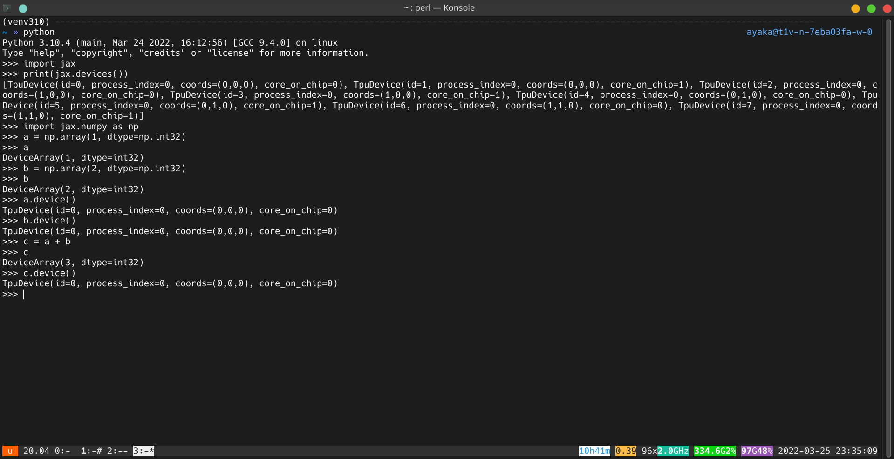

# TPU Starter

Everything you want to know about Google Cloud TPUs

**Note**: This is a TPU introduction article in progress. It will be expand and revised in the near future.

## 1. Introduction

### 1.1. Why TPU?

**TL;DR**: TPU is to GPU as GPU is to CPU.

TPU is a special hardware designed specifically for machine learning, so it is more cost-effective to use TPU than GPU.

Generally speaking, machine learning (including deep learning) programs run much faster on TPU. There is a [performance comparison](https://github.com/huggingface/transformers/blob/main/examples/flax/language-modeling/README.md#runtime-evaluation) in Hugging Face Transformers:


For researchers, the [TRC program](https://sites.research.google/trc/about/) provides free TPU, so this is the best way to get computational resources. For more details on the TRC program, please see below.

### 1.2. TPU is so good, why isn't it popular?

1\. If you want to use PyTorch, TPU may not be suitable for you. TPU is poorly supported by PyTorch. In one of my experiments, one batch took about 14 seconds to run on CPU, but over 4 hours to run on TPU. Twitter user @mauricetpunkt also thinks [PyTorch's performance on TPUs is bad](https://twitter.com/mauricetpunkt/status/1506944350281945090).

2\. Although a single TPU v3-8 device has 8 cores (16 GiB memory for each core), you need to write extra code to make use of all the 8 cores (see [named axes and easy-to-revise parallelism](https://jax.readthedocs.io/en/latest/notebooks/xmap_tutorial.html) in the JAX documentation). Otherwise, only the first core is used.

### 1.3. I know TPU is good now. Can I touch a real TPU?

Unfortunately, in most cases you cannot touch a TPU physically. They are only available through cloud services.

### 1.4. How do I get access to TPU?

You can create TPU instances on [Google Cloud Platform](https://cloud.google.com/tpu). For more information on setting up TPU, please see below. You can also use [Google Colab](https://colab.research.google.com/), but I don't recommend it. Besides, if you get free access to TPU from the [TRC program](https://sites.research.google/trc/about/), you will be using Google Cloud Platform, not Google Colab.

### 1.5. What does it mean to create a TPU instance? What do I actually get?

After creating a TPU v3-8 instance on Google Cloud Platform, you will get a Ubuntu 20.04 cloud server with sudo access, 96 cores, 335 GiB memory and one TPU device with 8 cores (128 GiB TPU memory in total).

This is very similar to the way we use GPU. In most cases, when you use a GPU, you use a Linux server that connects with a GPU. When you use a TPU, you use a Linux server that connects with a TPU.

TODO: Add a htop image here.

After SSH-ing in to the server, you can open a Python REPL and do some computation without TPU:


Or you can do some calculations on TPU:



### 1.6. How to apply for the TRC program?

You will have free access to TPU for 30 days if you apply for the [TPU Research Cloud](https://sites.research.google/trc/about/) program. Shawn has written a wonderful article in [google/jax#2108](https://github.com/google/jax/issues/2108#issuecomment-866238579). Anyone who is interested in TPU should read it immediately.

### 1.7. TODO

- Cloud TPU machine: TPU VM, TPU Node (deprecated), Colab TPU (different)
- Deep learning libraries: [Tensorflow](Tensorflow) (officially supported by Google), [PyTorch](https://pytorch.org/) (supports TPU via PyTorch XLA), [JAX](https://github.com/google/jax) (latest and most suitable for TPU)
- Linear algebra libraries: [NumPy](https://numpy.org/) (CPU only), [JAX](https://github.com/google/jax) (cross-platform)

## 2. Environment Setup

### 2.1. Create a TPU instance

Open [Google Cloud Platform](https://cloud.google.com/tpu), navigate to the [TPU management page](https://console.cloud.google.com/compute/tpus).


Click the console button on the top-right corner to activate Cloud Shell.

In Cloud Shell, type the following command to create a Cloud TPU VM v3-8 with TPU software version v2-nightly20210914:

```sh
gcloud alpha compute tpus tpu-vm create node-1 --project tpu-develop --zone=europe-west4-a --accelerator-type=v3-8 --version=v2-nightly20210914
```

If the command fails because Google has no more TPUs to allocate, you can rerun the command again.

### 2.2. Modify VPC firewall

TODO: Add a screenshot.

### 2.3. Basic configurations

Before you can SSH into the Cloud VM, you need to login by the `gcloud` command:

```sh
gcloud alpha compute tpus tpu-vm ssh node-1 --zone europe-west4-a
```

After logging in, you can add your public key to `~/.ssh/authorized_keys`.

Install packages:

```sh
sudo apt update
sudo apt upgrade
sudo apt install -y neofetch zsh mosh byobu
sudo reboot
```

Install Python 3.10:

```sh
sudo apt install -y software-properties-common
sudo add-apt-repository ppa:deadsnakes/ppa
sudo apt install -y python3.10 python3.10-distutils python3.10-dev
curl -sS https://bootstrap.pypa.io/get-pip.py | sudo python3.10
python3.10 -m pip install virtualenv
python3.10 -m virtualenv ~/.venv310
. ~/.venv310/bin/activate
```

Install JAX with TPU support:

```sh
pip install -U pip
pip install -U wheel
pip install "jax[tpu]==0.3.4" -f https://storage.googleapis.com/jax-releases/libtpu_releases.html
```

Install common packages and libraries:

```sh
pip install -r requirements.txt
```

### 2.4. How can I verify that the TPU is working?

Run:

```python
import jax
import jax.numpy as np
import jax.random as rand

print(jax.devices())  # should print TPU

key = rand.PRNGKey(42)

key, *subkey = rand.split(key, num=3)
a = rand.uniform(subkey[0], shape=(10000, 100000))
b = rand.uniform(subkey[1], shape=(100000, 10000))

c = np.dot(a, b)
print(c.shape)
```

### 2.5. Development environment

TODO: Introduce oh-my-zsh, mosh, byobu, VSCode Remote-SSH.

## 3. JAX Basics

### 3.1. Why JAX?

TODO: Compare JAX, Tensorflow and PyTorch.

### 3.2. The JAX ecosystem

- [JAX](https://github.com/google/jax) (basis)
- [Flax](https://github.com/google/flax) (neural network)
- [DM Haiku](https://github.com/deepmind/dm-haiku) (neural network)
- [Optax](https://github.com/deepmind/optax) (optimizer)

## 4. Best Practices

### 4.1. Import convention

On 16 January 2019, Colin Raffel wrote in [a blog article](https://colinraffel.com/blog/you-don-t-know-jax.html) that the convention at that time was to import original numpy as `onp`.

On 5 November 2020, Niru Maheswaranathan said in [a tweet](https://twitter.com/niru_m/status/1324078070546882560) that he thinks the convention at that time was to import jax as `jnp` and to leave original numpy as `np`.

### 4.2. Share files across multiple TPU VM instances

TODO: Internal IP, maybe sshfs?

### 4.3. Manage random keys in JAX

### 4.4. Serialize model parameters

## 5. Common Questions

### 5.1. What is `a[:, None]`?

### 5.2. How to understand `np.einsum`?

## 6. Common Gotchas

### 6.1. Indexing an array with an array

### 6.2. `np.dot` and `torch.dot` is different!

### 6.3. TPU cannot do simple arithmetic!

[google/jax#9973](https://github.com/google/jax/issues/9973).

## 7. More Resources about TPU

Libraries:

- [Hugging Face Accelerate](https://github.com/huggingface/accelerate) - accelerate PyTorch code on TPU (but PyTorch's performance on TPU is not ideal)

Tutorials:

- https://github.com/shawwn/jaxnotes/blob/master/notebooks/001_jax.ipynb

Community:

As of 23 Feb, 2022, there is no official chat group for Cloud TPUs. You can join our unofficial chat group [@cloudtpu](https://t.me/cloudtpu) on Telegram.
