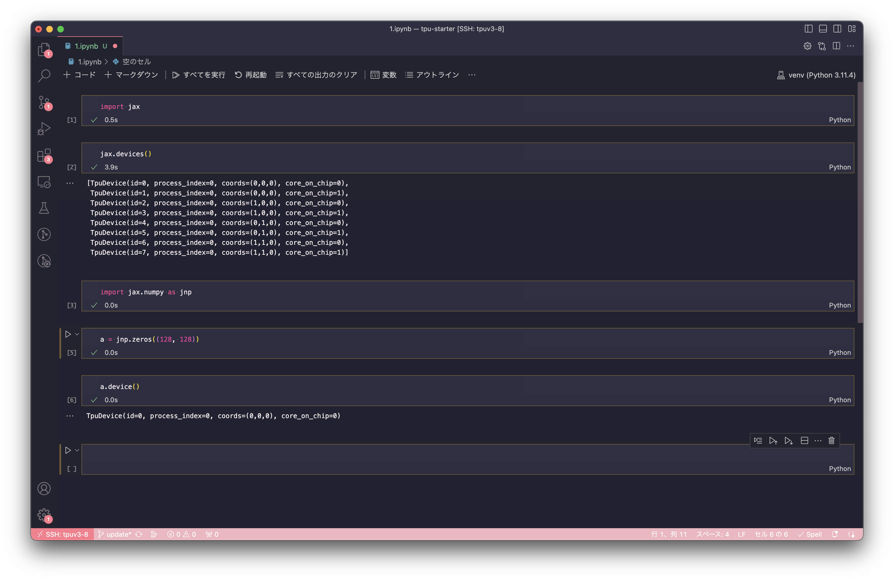

# TPU Starter

<h4 align="center">
    <p>
        <b>中文</b> |
        <a href="https://github.com/ayaka14732/tpu-starter/blob/main/README.md">English</a> |
        <a href="https://github.com/ayaka14732/tpu-starter/blob/main/README_ko.md">한국어</a>
    <p>
</h4>

关于 Google Cloud TPU 你想知道的所有事

* [1. 社群](#1-社群)
* [2. 简介](#2-简介)
    * [2.1. 为什么我要用 TPU？](#21-为什么我要用-tpu)
    * [2.2. 如何得到免费的 TPU？](#22-如何得到免费的-tpu)
    * [2.3. 如果 TPU 这么好，为什么我很少见到别人使用？](#23-如果-tpu-这么好为什么我很少见到别人使用)
    * [2.4. 我现在知道 TPU 很好了。我可以触摸 TPU 吗？](#24-我现在知道-tpu-很好了我可以触摸-tpu-吗)
    * [2.5. 创建 TPU 实例是什么意思？我创建的到底是什么？](#25-创建-tpu-实例是什么意思我创建的到底是什么)
* [3. TRC Program 简介](#3-trc-program-简介)
    * [3.1. 如何申请 TRC program？](#31-如何申请-trc-program)
    * [3.2. TRC program 真的不要钱吗？](#32-trc-program-真的不要钱吗)
* [4. 使用 TPU VM](#4-使用-tpu-vm)
    * [4.1. 创建 TPU VM](#41-创建-tpu-vm)
    * [4.2. 将 SSH 公钥加入 Google Cloud](#42-将-ssh-公钥加入-google-cloud)
    * [4.3. SSH 进入 TPU VM](#43-ssh-进入-tpu-vm)
    * [4.4. 验证 TPU VM 具有 TPU](#44-验证-tpu-vm-具有-tpu)
    * [4.5. 在 TPU VM 中配置开发环境](#45-在-tpu-vm-中配置开发环境)
    * [4.6. 验证 JAX 可以正常使用](#46-验证-jax-可以正常使用)
    * [4.7. 使用 Byobu 确保程序持续运行](#47-使用-byobu-确保程序持续运行)
    * [4.8. 配置 VSCode Remote-SSH](#48-配置-vscode-remote-ssh)
    * [4.9. 在 TPU VM 上使用 Jupyter Notebook](#49-在-tpu-vm-上使用-jupyter-notebook)
* [5. 使用 TPU Pod](#5-使用-tpu-pod)
    * [5.1. 创建子网](#51-创建子网)
    * [5.2. 禁用 Cloud Logging](#52-禁用-cloud-logging)
    * [5.3. 创建 TPU Pod](#53-创建-tpu-pod)
    * [5.4. SSH 进入 TPU Pod](#54-ssh-进入-tpu-pod)
    * [5.5. 修改 Host 0 上的 SSH 配置文件](#55-修改-host-0-上的-ssh-配置文件)
    * [5.6. 将 Host 0 的 SSH 公钥加入到所有 Host 中](#56-将-host-0-的-ssh-公钥加入到所有-host-中)
    * [5.7. 配置 podrun 命令](#57-配置-podrun-命令)
    * [5.8. 配置 NFS](#58-配置-nfs)
    * [5.9. 在 TPU Pod 中配置开发环境](#59-在-tpu-pod-中配置开发环境)
    * [5.10. 验证 JAX 可以正常使用](#510-验证-jax-可以正常使用)
* [6. TPU Best Practices](#6-tpu-best-practices)
    * [6.1. Prefer Google Cloud Platform to Google Colab](#61-prefer-google-cloud-platform-to-google-colab)
    * [6.2. Prefer TPU VM to TPU node](#62-prefer-tpu-vm-to-tpu-node)
* [7. JAX Best Practices](#7-jax-best-practices)
    * [7.1. Import convention](#71-import-convention)
    * [7.2. Manage random keys in JAX](#72-manage-random-keys-in-jax)
    * [7.3. Conversion between NumPy arrays and JAX arrays](#73-conversion-between-numpy-arrays-and-jax-arrays)
    * [7.4. Conversion between PyTorch tensors and JAX arrays](#74-conversion-between-pytorch-tensors-and-jax-arrays)
    * [7.5. Get the shapes of all parameters in a nested dictionary](#75-get-the-shapes-of-all-parameters-in-a-nested-dictionary)
    * [7.6. The correct way to generate random numbers on CPU](#76-the-correct-way-to-generate-random-numbers-on-cpu)
    * [7.7. Use optimizers from Optax](#77-use-optimizers-from-optax)
    * [7.8. Use the cross-entropy loss implementation from Optax](#78-use-the-cross-entropy-loss-implementation-from-optax)
* [8. How Can I...](#8-how-can-i)
    * [8.1. Share files across multiple TPU VM instances](#81-share-files-across-multiple-tpu-vm-instances)
    * [8.2. Monitor TPU usage](#82-monitor-tpu-usage)
    * [8.3. Start a server on TPU VM](#83-start-a-server-on-tpu-vm)
    * [8.4. Run separate processes on different TPU cores](#84-run-separate-processes-on-different-tpu-cores)
* [9. Common Gotchas](#9-common-gotchas)
    * [9.1. TPU VMs will be rebooted occasionally](#91-tpu-vms-will-be-rebooted-occasionally)
    * [9.2. One TPU core can only be used by one process at a time](#92-one-tpu-core-can-only-be-used-by-one-process-at-a-time)
    * [9.3. TCMalloc breaks several programs](#93-tcmalloc-breaks-several-programs)
    * [9.4. libtpu.so already in used by another process](#94-libtpuso-already-in-used-by-another-process)
    * [9.5. JAX does not support the multiprocessing fork strategy](#95-jax-does-not-support-the-multiprocessing-fork-strategy)

<!-- Created by https://github.com/ekalinin/github-markdown-toc -->

这个项目是受到 [Cloud Run FAQ](https://github.com/ahmetb/cloud-run-faq) 的启发创建的。Cloud Run FAQ 是社群维护的关于另一个谷歌产品的知识仓库。

## 1. 社群

谷歌官方 Discord 已经建立了 `#tpu-research-cloud` channel 频道，参见 https://twitter.com/googledeveurope/status/1583032777984835585。

## 2. 简介

### 2.1. 为什么我要用 TPU？

**一句话介绍**：TPU 与 GPU 的关系就像 GPU 与 CPU 的关系。

TPU 是一种专为机器学习设计的硬件。可以参看 Hugging Face Transformers 中的[性能比较](https://github.com/huggingface/transformers/blob/main/examples/flax/language-modeling/README.md#runtime-evaluation)。


此外，谷歌的 [TRC program](https://sites.research.google/trc/about/) 为研究者提供免费的 TPU 资源。如果你曾经想过用什么计算资源训练模型，你就应该试试 TRC program，因为这是我所知道的最佳选择。下方有更多关于 TRC program 的介绍。

### 2.2. 如何得到免费的 TPU？

研究者可以申请 [TRC program](https://sites.research.google/trc/about/)，从而得到免费的 TPU 资源。

### 2.3. 如果 TPU 这么好，为什么我很少见到别人使用？

如果你要使用 PyTorch，就无法利用 TPU。PyTorch 对 TPU 的支持不好。在我过去的一项实验中，我使用 PyTorch，一个 batch 在 CPU 需要 14 秒，而在 TPU 上却需要 4 小时。Twitter 用户 @mauricetpunkt 也认为 [TPU 上 PyTorch 的性能不理想](https://twitter.com/mauricetpunkt/status/1506944350281945090)。然而，事物是会变化的，你可以关注 [pytorch/xla](https://github.com/pytorch/xla) 这个项目以获得 PyTorch 对 TPU 的支持的最新情况。

综上所述，如果你想用 TPU 做深度学习，你应该使用 JAX 作为深度学习框架。事实上，许多流行的深度学习相关的库是支持 JAX 的。例如：

- [Hugging Face Transformers 中的许多模型支持 JAX](https://huggingface.co/docs/transformers/index#supported-frameworks)
- [Keras 支持使用 JAX 作为后端](https://keras.io/keras_core/announcement/)
- SkyPilot 有[使用 Flax 的例子](https://github.com/skypilot-org/skypilot/blob/master/examples/tpu/tpuvm_mnist.yaml)

此外，JAX 的设计非常清晰，受到了很多人的喜爱。例如，我最喜欢的开源项目就是 JAX。我在 Twitter 上发布过 [JAX 优于 PyTorch 的地方](https://twitter.com/ayaka14732/status/1688194164033462272)。

### 2.4. 我现在知道 TPU 很好了。我可以触摸 TPU 吗？

然而，我们一般不能触摸真正的 TPU。TPU 只能通过 Google 云服务访问。

在一些展览中，TPU 会被[摆在展柜中供人观赏](https://twitter.com/walkforhours/status/1696654844134822130)，这大概是与触摸 TPU 最接近的活动。

或许应聘成为 Google Cloud Infrastructure Engineer 才能真正触摸 TPU 吧。

### 2.5. 创建 TPU 实例是什么意思？我创建的到底是什么？

在 [Google Cloud Platform](https://cloud.google.com/tpu) 创建 TPU v3-8 实例后，你会得到一个有 sudo 权限的运行 Ubuntu 系统的云服务器，96 个 CPU 核心，335 GiB 内存，以及一个有 8 核的 TPU 设备（共 128 GiB TPU 内存）。


其实这与我们使用 GPU 的方式是一样的。通常我们使用 GPU 的时候，是使用一个连接了 GPU 的 Linux 服务器。同理，我们使用 TPU 的时候，也是使用一个连接了 TPU 的服务器。

## 3. TRC Program 简介

### 3.1. 如何申请 TRC program？

除了 TRC program 的 [主页](https://sites.research.google/trc/about/)，Shawn 在 [google/jax#2108](https://github.com/google/jax/issues/2108#issuecomment-866238579) 写过一个特别好的关于 TRC program 的文章，推荐所有对 TPU 感兴趣的人立即阅读。

### 3.2. TRC program 真的不要钱吗？

在前三个月，TRC program 完全不要钱，因为注册 Google Cloud 的前三个月会有免费试用的赠金。三个月之后，我每个月大概只花费 HK$13.95（约合 US$1.78）。这些钱是花在 TPU 服务器的网络流量上，而 TPU 设备本身是 TRC program 免费提供的。

## 4. 使用 TPU VM

### 4.1. 创建 TPU VM

打开 [Google Cloud Platform](https://cloud.google.com/tpu)，转到 [TPU 管理页面](https://console.cloud.google.com/compute/tpus)。


点击右上角的控制台按钮激活 Cloud Shell。

在 Cloud Shell 中输入以下命令创建 TPU v3-8 VM：

```sh
until gcloud alpha compute tpus tpu-vm create node-1 --project tpu-develop --zone europe-west4-a --accelerator-type v3-8 --version tpu-vm-base ; do : ; done
```

其中，`node-1` 是你想创建的 TPU VM 的名字，`--project` 是你的 Google Cloud project 的名字。

上述命令会持续执行创建 TPU VM 的命令直至创建成功。

### 4.2. 将 SSH 公钥加入 Google Cloud

对于 Google Cloud 的服务器，想要 SSH 进入，使用 `ssh-copy-id` 是错误的方法。正确方法如下：

首先在 Google Cloud 网页的搜索框中输入 SSH keys，跳转到对应页面，然后点击 edit，加入你的电脑中的 SSH 公钥。

查看自己电脑中 SSH 公钥的方法如下：

```sh
cat ~/.ssh/id_rsa.pub
```

如果你还没有创建过 SSH 密钥对，需要使用如下命令创建，再执行上面的命令查看：

```sh
ssh-keygen -t rsa -f ~/.ssh/id_rsa -N ""
```

在将 SSH 公钥加入 Google Cloud 时，需要特别注意用户名的值。在 SSH 公钥的字符串中，最后一部分的 `@` 符号前面的值为用户名。在加入 Google Cloud 时，Google Cloud 会为当前项目的所有服务器创建该用户名的用户。例如，对于 `ayaka@instance-1` 这个字符串，在加入 Google Cloud 时，Google Cloud 会在服务器中创建用户 `ayaka`。如果你希望 Google Cloud 创建其他用户名，可以手动修改这个字符串。例如，将上述字符串改为 `nixie@instance-1`，Google Cloud 就会创建用户 `nixie`。另外，这样修改不会影响 SSH 密钥的正常功能。

### 4.3. SSH 进入 TPU VM

创建或编辑自己电脑的 `~/.ssh/config`：

```sh
nano ~/.ssh/config
```

加入如下内容：

```
Host tpuv3-8-1
    User nixie
    Hostname 34.141.220.156
```

其中，`tpuv3-8-1` 是可以随意起的名字，`User` 是上一步中 Google Cloud 创建的用户名，`Hostname` 是 TPU VM 的 IP 地址。

然后，在自己的电脑中使用如下命令 SSH 进入 TPU VM：

```sh
ssh tpuv3-8-1
```

其中，`tpuv3-8-1` 是在 `~/.ssh/config` 中起的名字。

### 4.4. 验证 TPU VM 具有 TPU

```sh
ls /dev/accel*
```

如果出现如下输出：

```
/dev/accel0  /dev/accel1  /dev/accel2  /dev/accel3
```

则表示 TPU VM 确实具有 TPU。

### 4.5. 在 TPU VM 中配置开发环境

更新软件包：

```sh
sudo apt-get update -y -qq
sudo apt-get upgrade -y -qq
sudo apt-get install -y -qq golang neofetch zsh byobu
```

安装最新版 Python 3.11:

```sh
sudo apt-get install -y -qq software-properties-common
sudo add-apt-repository -y ppa:deadsnakes/ppa
sudo apt-get install -y -qq python3.11-full python3.11-dev
```

安装 Oh My Zsh：

```sh
sh -c "$(curl -fsSL https://raw.githubusercontent.com/ohmyzsh/ohmyzsh/master/tools/install.sh)" "" --unattended
sudo chsh $USER -s /usr/bin/zsh
```

创建 venv：

```sh
python3.11 -m venv ~/venv
```

激活 venv：

```sh
. ~/venv/bin/activate
```

在 venv 中安装 JAX：

```sh
pip install -U pip
pip install -U wheel
pip install -U "jax[tpu]" -f https://storage.googleapis.com/jax-releases/libtpu_releases.html
```

### 4.6. 验证 JAX 可以正常使用

激活 venv 后，使用如下命令验证 JAX 可以正常使用：

```sh
python -c 'import jax; print(jax.devices())'
```

如果输出中含有 `TpuDevice`，则表明 JAX 可以正常使用。

### 4.7. 使用 Byobu 确保程序持续运行

许多教程使用在命令后添加 `&` 的方法使命令转到后台运行，以便在退出 SSH 后命令仍能继续执行。然而，这样做是非常初级的方法。正确的方法是使用 Byobu 这样的窗口管理器。

要运行 Byobu，直接使用 `byobu` 命令，然后在打开的窗口中执行命令。要关闭窗口时，可以将电脑上的当前窗口直接强行关闭，Byobu 将在服务器上继续运行。再次连接服务器时，使用 `byobu` 命令可以调出之前的窗口。

Byobu 有许多高级的使用技巧，可以通过官方视频 [Learn Byobu while listening to Mozart](https://youtu.be/NawuGmcvKus) 学习。

### 4.8. 配置 VSCode Remote-SSH

打开 VSCode，在左侧打开 Extensions 面板，搜索并安装 Remote - SSH。

按 <kbd>F1</kbd> 键来打开命令面板。输入 ssh，点击 “Remote-SSH: Connect to Host...” 这一项，然后点击在 `~/.ssh/config` 中设置的服务器名字（例如 `tpuv3-8-1`）。等待 VSCode 在服务器上完成设置后，就可以使用 VSCode 在服务器上进行开发。


在电脑上可以使用命令快速打开服务器上的某个目录。例如：

```sh
code --remote ssh-remote+tpuv3-8-1 /home/ayaka/tpu-starter
```

这个命令会使用 VSCode 打开 `tpuv3-8-1` 上的 `/home/ayaka/tpu-starter` 这个目录。

### 4.9. 在 TPU VM 上使用 Jupyter Notebook

在配置好 VSCode 的 Remote-SSH 后，就可以在 VSCode 中使用 Jupyter Notebook。效果如下：



这里有两个问题需要注意：第一是 Jupyter Notebook 右上角的 Kernel 要选择 venv 中的，也就是在前面的步骤中创建的 `~/venv/bin/python`；第二是首次运行时会提示安装 VSCode 的 Jupyter 扩展，并且在 venv 中安装 ipykernel，需要点击确定。

## 5. 使用 TPU Pod

### 5.1. 创建子网

要创建 TPU Pod，需要先创建一个新的 VPC 网络，并在该网络的对应区域（例如 `europe-west4-a`）中创建子网。

TODO: Purpose?

### 5.2. 禁用 Cloud Logging

TODO: Reason? Steps?

### 5.3. 创建 TPU Pod

按前文创建 TPU VM 时使用的方法打开 Cloud Shell，使用如下命令创建 TPU v3-32 Pod：

```sh
until gcloud alpha compute tpus tpu-vm create node-1 --project tpu-advanced-research --zone europe-west4-a --accelerator-type v3-32 --version v2-alpha-pod --network advanced --subnetwork advanced-subnet-for-europe-west4 ; do : ; done
```

其中，`node-1` 是你想创建的 TPU VM 的名字，`--project` 是你的 Google Cloud project 的名字，`--network` 和 `--subnetwork` 是上一步中创建的网络和子网的名字。

### 5.4. SSH 进入 TPU Pod

由于 TPU Pod 是多台主机，我们需要选定一台主机，设其为 Host 0，然后 SSH 进入 Host 0 执行命令。由于在 Google Cloud 网页上加入的 SSH 公钥会被加入到所有主机中，因此所有主机都是可以直接通过 SSH 密钥连接的，所以我们可以设任意一台主机为 Host 0。SSH 进入 Host 0 的方法与上述 TPU VM 相同。

### 5.5. 修改 Host 0 上的 SSH 配置文件

SSH 进入 Host 0 后，需要作出如下配置：

```sh
nano ~/.ssh/config
```

加入如下内容：

```
Host 172.21.12.* 127.0.0.1
    StrictHostKeyChecking no
    UserKnownHostsFile /dev/null
    LogLevel ERROR
```

其中，`172.21.12.*` 是由前面的步骤中创建的子网的 IP 地址范围决定的。这里使用 `172.21.12.*`，是因为在前面创建子网时，指定了 IP 地址范围为 172.21.12.0/24。

这样做是因为 ssh 的 `known_hosts` 是为了防止中间人攻击而创建的，而我们在这里使用的是内网环境，不需要防止中间人攻击，也就不需要这个文件，因此我们将其指定为 `/dev/null`。此外，如果有了 `known_hosts`，在第一次连接要手动确认服务器的指纹，在内网环境中这样做是没有必要的，而且不利于程序的自动化。

然后执行以下命令修改这个配置文件的权限。如果不修改，则配置文件不会生效：

```sh
chmod 600 ~/.ssh/config
```

### 5.6. 将 Host 0 的 SSH 公钥加入到所有 Host 中

在 Host 0 上生成密钥对：

```sh
ssh-keygen -t rsa -f ~/.ssh/id_rsa -N ""
```

查看生成的 SSH 公钥：

```sh
cat ~/.ssh/id_rsa.pub
```

然后将公钥加入 Google Cloud 的 SSH keys 中，这个公钥就会被自动传播到所有 Host 中。

### 5.7. 配置 `podrun` 命令

`podrun` 命令是一个正在开发中的工具，达到的效果是在 Host 0 上执行命令，可以通过 SSH 在所有 Host 上执行。

下载 `podrun`：

```sh
wget https://raw.githubusercontent.com/ayaka14732/llama-2-jax/d8220b8c95789b14fe55417edc1d9482389aa2c4/podrun
chmod +x podrun
```

下载后使用 nano 编辑这个文件，将第一行的 `python` 改为 `python3`。

TODO: Update the source.

使用如下命令编辑 `~/podips.txt`：

```sh
nano ~/podips.txt
```

将其他 Host 的内网 IP 地址保存在 `~/podips.txt` 中（每行一个），例如：

```sh
172.21.12.86
172.21.12.87
172.21.12.83
```

TPU v3-32 包括 4 台主机，除去 Host 0 外还有 3 台主机，所以 TPU v3-32 的 `~/podips.txt` 中应该包括 3 个 IP 地址。

使用系统 pip3 安装 Fabric：

```sh
pip3 install fabric
```

使用 `podrun` 在所有主机上输出猫叫：

```sh
./podrun -iw -- echo meow
```

### 5.8. 配置 NFS

安装 NFS 服务器和客户端：

```sh
./podrun -i -- sudo apt-get update -y -qq
./podrun -i -- sudo apt-get upgrade -y -qq
./podrun -- sudo apt-get install -y -qq nfs-common
sudo apt-get install -y -qq nfs-kernel-server
sudo mkdir -p /nfs_share
sudo chown -R nobody:nogroup /nfs_share
sudo chmod 777 /nfs_share
```

修改 `/etc/exports`：

```sh
sudo nano /etc/exports
```

加入：

```
/nfs_share  172.21.12.0/24(rw,sync,no_subtree_check)
```

执行：

```sh
sudo exportfs -a
sudo systemctl restart nfs-kernel-server

./podrun -- sudo mkdir -p /nfs_share
./podrun -- sudo mount 172.21.12.2:/nfs_share /nfs_share
./podrun -i -- ln -sf /nfs_share ~/nfs_share

touch ~/nfs_share/meow
./podrun -i -- ls -la ~/nfs_share/meow
```

其中，`172.21.12.2` 要更换为 Host 0 的内网 IP 地址。

### 5.9. 在 TPU Pod 中配置开发环境

保存到 `~/nfs_share/setup.sh`：

```sh
#!/bin/bash

export DEBIAN_FRONTEND=noninteractive

sudo apt-get update -y -qq
sudo apt-get upgrade -y -qq
sudo apt-get install -y -qq golang neofetch zsh byobu

sudo apt-get install -y -qq software-properties-common
sudo add-apt-repository -y ppa:deadsnakes/ppa
sudo apt-get install -y -qq python3.11-full python3.11-dev

sh -c "$(curl -fsSL https://raw.githubusercontent.com/ohmyzsh/ohmyzsh/master/tools/install.sh)" "" --unattended
sudo chsh $USER -s /usr/bin/zsh

python3.11 -m venv ~/venv

. ~/venv/bin/activate

pip install -U pip
pip install -U wheel
pip install -U "jax[tpu]" -f https://storage.googleapis.com/jax-releases/libtpu_releases.html
```

执行：

```sh
chmod +x ~/nfs_share/setup.sh
./podrun -i -- ~/nfs_share/setup.sh
```

### 5.10. 验证 JAX 可以正常使用

使用如下命令验证 JAX 可以正常使用：

```sh
./podrun -ic -- ~/venv/bin/python -c 'import jax; jax.distributed.initialize(); jax.process_index() == 0 and print(jax.devices())'
```

如果输出中含有 `TpuDevice`，则表明 JAX 可以正常使用。

## 6. TPU Best Practices

### 6.1. Prefer Google Cloud Platform to Google Colab

[Google Colab](https://colab.research.google.com/) only provides TPU v2-8 devices, while on [Google Cloud Platform](https://cloud.google.com/tpu) you can select TPU v2-8 and TPU v3-8.

Besides, on Google Colab you can only use TPU through the Jupyter Notebook interface. Even if you [log in into the Colab server via SSH](https://ayaka.shn.hk/colab/), it is a docker image and you don't have root access. On Google Cloud Platform, however, you have full access to the TPU VM.

If you really want to use TPU on Google Colab, you need to run [the following script](01-basics/setup_colab_tpu.py) to set up TPU:

```python
import jax
from jax.tools.colab_tpu import setup_tpu

setup_tpu()

devices = jax.devices()
print(devices)  # should print TpuDevice
```

### 6.2. Prefer TPU VM to TPU node

When you are creating a TPU instance, you need to choose between TPU VM and TPU node. Always prefer TPU VM because it is the new architecture in which TPU devices are connected to the host VM directly. This will make it easier to set up the TPU device.

## 7. JAX Best Practices

### 7.1. Import convention

You may see two different kind of import conventions. One is to import `jax.numpy` as `np` and import the original numpy as `onp`. Another one is to import `jax.numpy` as `jnp` and leave original numpy as `np`.

On 16 Jan 2019, Colin Raffel wrote in [a blog article](https://colinraffel.com/blog/you-don-t-know-jax.html) that the convention at that time was to import original numpy as `onp`.

On 5 Nov 2020, Niru Maheswaranathan said in [a tweet](https://twitter.com/niru_m/status/1324078070546882560) that he thinks the convention at that time was to import `jax.numpy` as `jnp` and to leave original numpy as `np`.

We can conclude that the new convention is to import `jax.numpy` as `jnp`.

### 7.2. Manage random keys in JAX

The regular way is this:

```python
key, *subkey = rand.split(key, num=4)
print(subkey[0])
print(subkey[1])
print(subkey[2])
```

### 7.3. Conversion between NumPy arrays and JAX arrays

Use [`np.asarray`](https://jax.readthedocs.io/en/latest/_autosummary/jax.numpy.asarray.html) and [`onp.asarray`](https://numpy.org/doc/stable/reference/generated/numpy.asarray.html).

```python
import jax.numpy as np
import numpy as onp

a = np.array([1, 2, 3])  # JAX array
b = onp.asarray(a)  # converted to NumPy array

c = onp.array([1, 2, 3])  # NumPy array
d = np.asarray(c)  # converted to JAX array
```

### 7.4. Conversion between PyTorch tensors and JAX arrays

Convert a PyTorch tensor to a JAX array:

```python
import jax.numpy as np
import torch

a = torch.rand(2, 2)  # PyTorch tensor
b = np.asarray(a.numpy())  # JAX array
```

Convert a JAX array to a PyTorch tensor:

```python
import jax.numpy as np
import numpy as onp
import torch

a = np.zeros((2, 2))  # JAX array
b = torch.from_numpy(onp.asarray(a))  # PyTorch tensor
```

This will result in a warning:

```
UserWarning: The given NumPy array is not writable, and PyTorch does not support non-writable tensors. This means writing to this tensor will result in undefined behavior. You may want to copy the array to protect its data or make it writable before converting it to a tensor. This type of warning will be suppressed for the rest of this program. (Triggered internally at  ../torch/csrc/utils/tensor_numpy.cpp:178.)
```

If you need writable tensors, you can use `onp.array` instead of `onp.asarray` to make a copy of the original array.

### 7.5. Get the shapes of all parameters in a nested dictionary

```python
jax.tree_map(lambda x: x.shape, params)
```

### 7.6. The correct way to generate random numbers on CPU

Use the [jax.default_device()](https://jax.readthedocs.io/en/latest/_autosummary/jax.default_device.html) context manager:

```python
import jax
import jax.random as rand

device_cpu = jax.devices('cpu')[0]
with jax.default_device(device_cpu):
    key = rand.PRNGKey(42)
    a = rand.poisson(key, 3, shape=(1000,))
    print(a.device())  # TFRT_CPU_0
```

See <https://github.com/google/jax/discussions/9691#discussioncomment-3650311>.

### 7.7. Use optimizers from Optax

### 7.8. Use the cross-entropy loss implementation from Optax

`optax.softmax_cross_entropy_with_integer_labels`

## 8. How Can I...

### 8.1. Share files across multiple TPU VM instances

TPU VM instances in the same zone are connected with internal IPs, so you can [create a shared file system using NFS](https://tecadmin.net/how-to-install-and-configure-an-nfs-server-on-ubuntu-20-04/).

### 8.2. Monitor TPU usage

[jax-smi](https://github.com/ayaka14732/jax-smi)

### 8.3. Start a server on TPU VM

Example: Tensorboard

Although every TPU VM is allocated with a public IP, in most cases you should expose a server to the Internet because it is insecure.

Port forwarding via SSH

```
ssh -C -N -L 127.0.0.1:6006:127.0.0.1:6006 tpu1
```

### 8.4. Run separate processes on different TPU cores

https://gist.github.com/skye/f82ba45d2445bb19d53545538754f9a3

## 9. Common Gotchas

### 9.1. TPU VMs will be rebooted occasionally

As of 24 Oct 2022, the TPU VMs will be rebooted occasionally if there is a maintenance event.

The following things will happen:

1. All the running processes will be terminated
2. The external IP address will be changed

We can save the model parameters, optimiser states and other useful data occasionally, so that the model training can be easily resumed after termination.

We should use `gcloud` command instead of connect directly to it with SSH. If we have to use SSH (e.g. if we want to use VSCode, SSH is the only choice), we need to manually change the target IP address.

### 9.2. One TPU core can only be used by one process at a time

See also: §10.5.

Unlike GPU, you will get an error if you run two processes on TPU at a time:

```
I0000 00:00:1648534265.148743  625905 tpu_initializer_helper.cc:94] libtpu.so already in use by another process. Run "$ sudo lsof -w /dev/accel0" to figure out which process is using the TPU. Not attempting to load libtpu.so in this process.
```

### 9.3. TCMalloc breaks several programs

[TCMalloc](https://github.com/google/tcmalloc) is Google's customized memory allocation library. On TPU VM, `LD_PRELOAD` is set to use TCMalloc by default:

```sh
$ echo LD_PRELOAD
/usr/lib/x86_64-linux-gnu/libtcmalloc.so.4
```

However, using TCMalloc in this manner may break several programs like gsutil:

```sh
$ gsutil --help
/snap/google-cloud-sdk/232/platform/bundledpythonunix/bin/python3: /snap/google-cloud-sdk/232/platform/bundledpythonunix/bin/../../../lib/x86_64-linux-gnu/libm.so.6: version `GLIBC_2.29' not found (required by /usr/lib/x86_64-linux-gnu/libtcmalloc.so.4)
```

The [homepage of TCMalloc](http://goog-perftools.sourceforge.net/doc/tcmalloc.html) also indicates that `LD_PRELOAD` is tricky and this mode of usage is not recommended.

If you encounter problems related to TCMalloc, you can disable it in the current shell using the command:

```sh
unset LD_PRELOAD
```

### 9.4. `libtpu.so` already in used by another process

```sh
if ! pgrep -a -u $USER python ; then
    killall -q -w -s SIGKILL ~/.venv311/bin/python
fi
rm -rf /tmp/libtpu_lockfile /tmp/tpu_logs
```

See also <https://github.com/google/jax/issues/9220#issuecomment-1015940320>.

### 9.5. JAX does not support the multiprocessing `fork` strategy

Use the `spawn` or `forkserver` strategies.

See <https://github.com/google/jax/issues/1805#issuecomment-561244991>.
